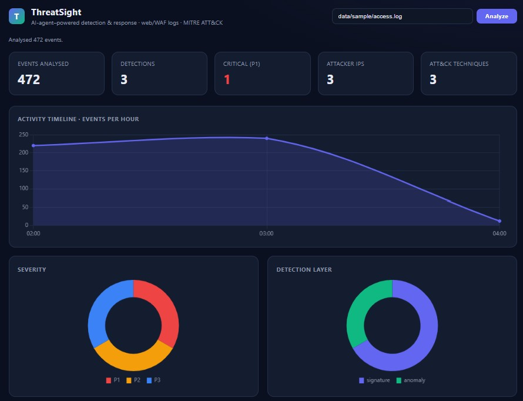
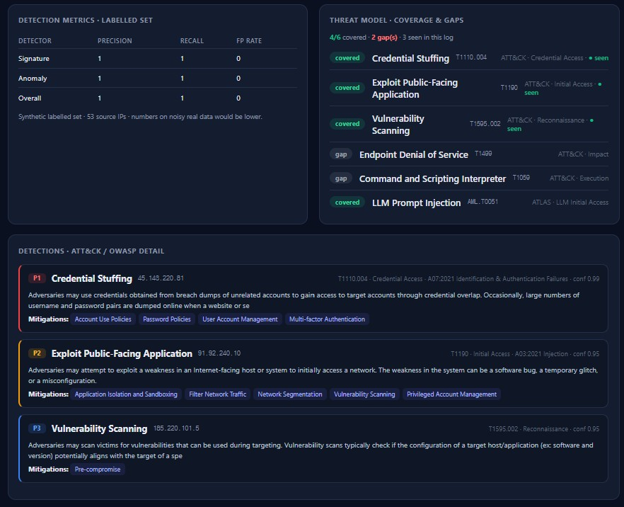
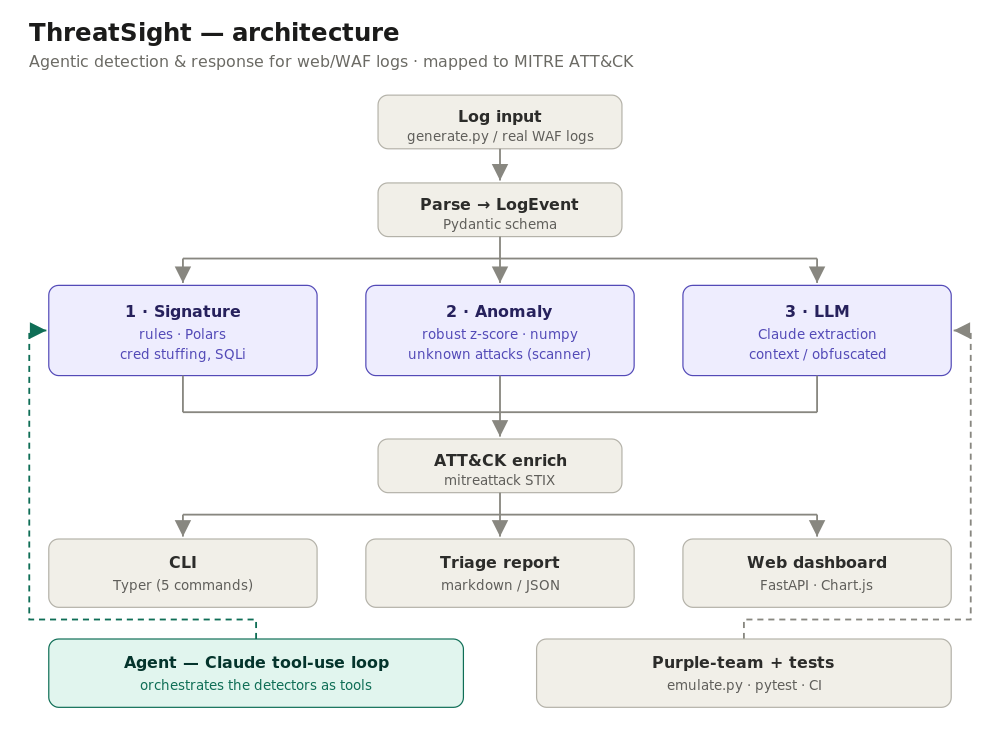

# ThreatSight

[](https://github.com/ellasypark/ThreatSight/actions/workflows/ci.yml)

**An AI-agent–powered detection & response analyzer for web / WAF logs.** It triages raw access logs through three detection layers, runs a **multi-agent LLM investigation** over the hits, and maps everything to **MITRE ATT&CK**, **OWASP**, and **MITRE ATLAS** — presented as a CLI report and a web dashboard.

> One line: *turn a noisy web/WAF log into a prioritized, framework-mapped incident report a responder can act on in minutes.*


<p align="center">
  
  
</p>
---

## Why this exists

A busy web service logs **millions of requests a day**, and real attacks — credential stuffing, SQL injection, scanning — hide among them. A WAF blocks and logs the flood, but the slow part of D&R isn't *blocking* — it's **deciding what actually matters, why, and what to do about it.** Two problems follow:

- **No one can read millions of log lines**, especially at 3am. Attacks get missed, or analysts drown in alert fatigue.
- **Each method falls short alone:** signature rules only catch attacks you already defined; pure anomaly detection is noisy; and even when an alert fires, a human still has to investigate it and write it up — slow, and inconsistent between analysts and shifts.

ThreatSight tackles all of this at once: **layered detection** (known *and* unknown attacks), an **agent that does the investigation for you**, a **coverage view of what it can't yet catch**, and a **measured, tested** pipeline so the alerts are trustworthy.

---

## Architecture



```
access.log ─▶ parse ─▶ ┌─ signature  (rules: credential stuffing, SQLi, scanning…)
                       ├─ anomaly    (robust z-score / MAD on per-IP behavior)
                       └─ LLM        (Claude declarative extraction for obfuscated cases)
                                │
                                ▼
                     multi-agent investigation
                     triage ─▶ investigate (tool-use + RAG) ─▶ justify
                                │
                                ▼
              ATT&CK · OWASP · ATLAS mapping  ─▶  CLI report + web dashboard
```

---

## Detection layers

| Layer | Catches | How |
|---|---|---|
| **1. Signature** | known attacks | deterministic rules per ATT&CK technique (credential stuffing `T1110.004`, SQLi `T1190`, scanning `T1595.002`) |
| **2. Anomaly** | unknown / novel | robust z-score / MAD outlier detection per source IP — no signature needed |
| **3. LLM** | obfuscated / context-dependent | Claude tool-use forces findings into a typed Pydantic schema, with an explanation |

The rule layers are deterministic and unit-tested; the LLM layer adds judgment on top, not in place of them.

## Multi-agent investigation (the core)

`orchestrator.py` runs three roles in sequence — this is what makes ThreatSight *investigate* rather than just *alert*:

1. **Triage agent** — ranks the detected IPs by priority and disposition.
2. **Investigation agent** — a Claude **tool-use loop** with real tools: `run_signature_detectors`, `run_anomaly_detection`, `get_events_for_ip` (forensic pivot), `lookup_attack_technique`, `check_ip_reputation`, and **`search_attack_knowledge`** — **RAG** over the ATT&CK knowledge base (semantic embeddings via sentence-transformers, with a TF-IDF fallback).
3. **Justification agent** — writes the analyst-style assessment and recommended action.

**Context management:** tools return small summaries, never raw log lines, so the model reasons over a tiny relevant context instead of 100K events. **Guardrails:** per-step tracing, tool errors fed back to the model, and a `max_steps` cost bound. This is the part that demonstrates tool/function calling, context management, and grounding an LLM in retrieved knowledge rather than its parameters.

## Framework mapping

Every finding maps to **MITRE ATT&CK** (technique, tactic, mitigations, data sources — from the official STIX dataset), the **OWASP Top 10** (web) / **OWASP LLM Top 10**, and **MITRE ATLAS** for LLM-abuse cases. Stable frameworks (the 10 OWASP categories) use a static map; anything unrecognized is classified by the LLM.

## Threat model: coverage & gaps

`threat-model` asks the LLM to propose the techniques a given system (e.g. *a public web app behind a WAF*) is exposed to, then marks each as **covered** (a detector exists), **gap** (no detector yet), or **seen** (observed in the current log). The dashboard renders this so a reviewer sees what ThreatSight does *not* yet catch — honest coverage, not a wall of green.

---

## Measured performance

Detection quality on a **synthetic labelled set** (50 benign IPs + 3 known attackers), reproducible with `threatsight metrics`:

| Detector | Precision | Recall | FP rate |
|----------|-----------|--------|---------|
| Signature | 1.00 | 1.00 | 0.00 |
| Anomaly | 1.00 | 1.00 | 0.00 |
| Overall | 1.00 | 1.00 | 0.00 |

These are a **regression baseline, not a production benchmark** — the set is clean by construction, so on noisy real traffic the numbers would be lower. CI gates these so a change that breaks detection fails the build. Swapping in a public WAF dataset to measure real-world precision/recall is the obvious next step.

---

## Install & use

```bash
git clone https://github.com/<USER>/ThreatSight.git
cd ThreatSight
pip install .                              # installs deps + the `threatsight` command

threatsight generate                       # synthetic sample logs (normal + several attacks)
threatsight analyze data/sample/access.log              # rules: signature + anomaly (fast, free)
threatsight analyze data/sample/access.log --format json
threatsight metrics                        # precision / recall / FP on the labelled set
threatsight emulate                        # purple-team coverage matrix
uvicorn threatsight.server:app --reload    # web dashboard at http://127.0.0.1:8000
```

### LLM features (need an Anthropic API key)

```bash
setx ANTHROPIC_API_KEY "sk-ant-..."        # Windows; reopen the terminal after

threatsight ai-analyze  data/sample/access.log          # declarative extraction via Claude
threatsight investigate data/sample/access.log          # multi-agent triage → investigate → justify
threatsight threat-model --system "a public web app behind a WAF"
threatsight llm-scan                                    # prompt-injection / jailbreak abuse (OWASP-LLM / ATLAS)
```

> If your network intercepts HTTPS and Anthropic calls fail with a certificate error, set `THREATSIGHT_INSECURE_SSL=1` for **local testing only**. It is off by default and must never be enabled in committed config.

---

## Repo layout

```
threatsight/
  generate.py     # synthetic logs (normal + credential stuffing + scanner + SQLi)
  parse.py        # log line -> validated LogEvent (Pydantic)
  detector.py     # LAYER 1 — signature detection
  anomaly.py      # LAYER 2 — behavioral anomaly detection
  ai_analyze.py   # LAYER 3 — LLM structured extraction (Claude)
  orchestrator.py # AGENT — multi-agent tool-use investigation loop
  rag.py          # RAG over the ATT&CK knowledge base (embeddings + TF-IDF fallback)
  attack.py       # MITRE ATT&CK enrichment from the official STIX dataset
  owasp.py        # OWASP Top 10 / OWASP-LLM mapping
  threat_model.py # LLM-proposed threat profile + coverage/gap
  metrics.py      # precision / recall / FP on a labelled set
  report.py       # triage report (markdown / JSON)
  server.py       # FastAPI server — web dashboard + /api/analyze
  frontend/       # web dashboard (Chart.js)
  emulate.py      # purple-team: emulate attacks + coverage matrix
  llm_abuse.py    # LLM-request abuse detection (OWASP-LLM / ATLAS)
  cli.py          # the `threatsight` CLI
tests/            # pytest: detections catch attacks, raise no false positives
.github/workflows/ci.yml
```

## Tech

Python · Typer (CLI) · FastAPI + Chart.js (dashboard) · Pydantic · Polars / NumPy · Anthropic Claude (tool-use) · sentence-transformers (RAG) · mitreattack-python (ATT&CK STIX) · pytest + GitHub Actions CI.

## Honest limits

- The performance numbers come from a clean synthetic set — a regression baseline, not a production benchmark.
- The LLM layers cost money and add latency; the deterministic layers run without an API key.
- Log data is **untrusted input**: a crafted log line is a prompt-injection vector against the investigation agent, so its outputs are advisory, not authoritative.
- Attribution is deliberately low-confidence — web-log TTPs are common to many actors, and ThreatSight does not claim otherwise.

## License

MIT