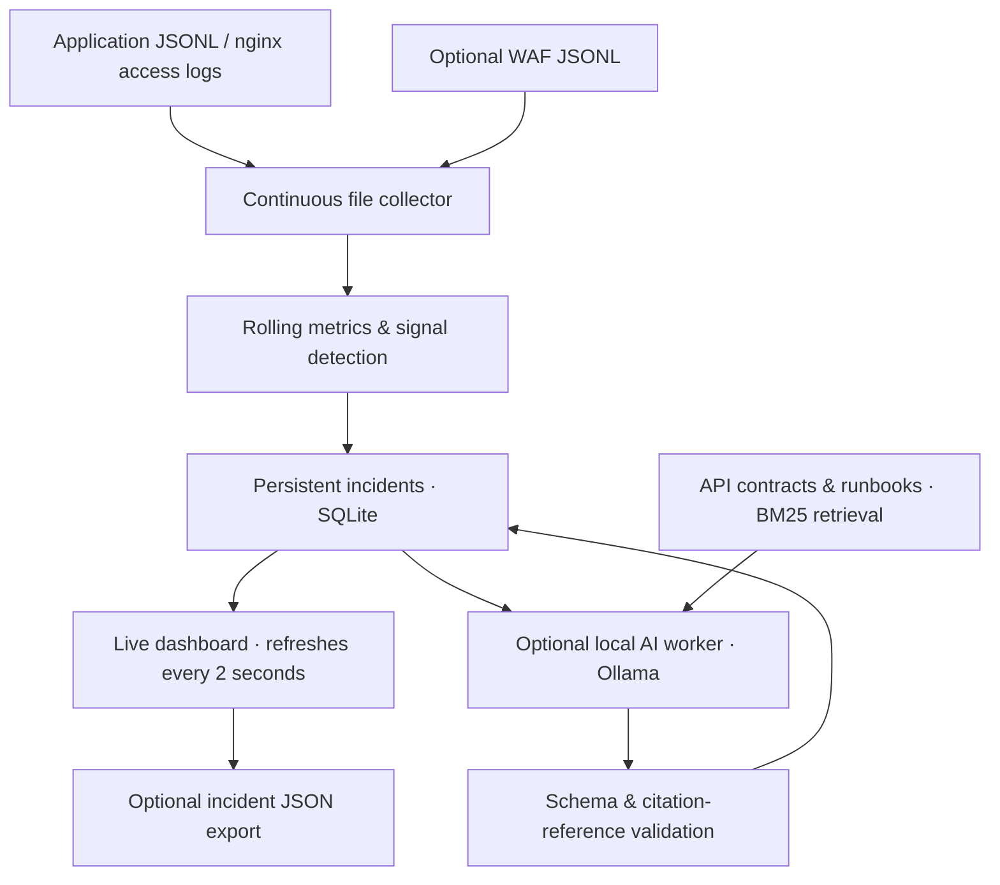

# ThreatSight

[](https://github.com/ellasypark/ThreatSight/actions/workflows/ci.yml)

**Local-first security and service monitoring for small teams. WAF optional. No paid API required.**

Built from experience with expensive, complex enterprise security tools. ThreatSight continuously reads local web/application logs, tracks incidents, and shows a live dashboard. Optional local AI investigates new or materially changed incidents.

## System


```mermaid
flowchart TD
    A[Application JSONL / nginx access logs] --> C[Continuous file collector]
    B[Optional WAF JSONL] --> C
    C --> D[Rolling metrics & signal detection]
    D --> E[Persistent incidents · SQLite]
    E --> F[Live dashboard · refreshes every 2 seconds]
    E --> G[Optional local AI worker · Ollama]
    H[API contracts & runbooks · BM25 retrieval] --> G
    G --> I[Schema & citation-reference validation]
    I --> E
    F --> J[Optional incident JSON export]
```

- **Live visibility:** application request counts, 5xx rates, affected routes, log-source health, and optional WAF blocks.
- **Incident tracking:** repeated errors, authentication failures, suspicious request patterns, traffic spikes, and WAF blocks; first/last seen, automatic quiet-period resolution, and reopening.
- **Durable collection:** SQLite checkpoints survive restarts; supports common file rotation/truncation and incomplete log writes.
- **Optional AI:** a separate local worker investigates new incidents, reopening, or doubled signal counts with a cooldown. Collection continues if the model fails. Service documents enable lexical RAG.

## Run

Python 3.12+. From the repository checkout:

```bash
python -m venv .venv
source .venv/bin/activate
pip install -e .

threatsight monitor /path/to/nginx/access.log
```

Open **http://127.0.0.1:8765**. Keep the process running; new log lines appear automatically. Multiple file paths are supported. No WAF is needed.

To try synthetic live traffic, start `threatsight monitor data/monitor-demo.jsonl`, then run this in another terminal:

```bash
python -m threatsight.monitoring.demo
```

For automatic local AI, install/start [Ollama](https://docs.ollama.com/quickstart), then:

```bash
ollama pull llama3.2:3b
threatsight monitor /path/to/app.jsonl --model llama3.2:3b
# Add --documents /path/to/documents.json to enable service-context RAG.
```

## Scope & evaluation

This is an early **single-process, local file monitor**, not a hosted SIEM. Monitoring windows use collection time; existing log contents are backfilled on first use. Rules are heuristic signals, not confirmed attacks. The UI is loopback-only. [Formats, thresholds, retention & operational limits →](docs/monitoring.md)

The separate investigation evaluator measures classification, abstention, retrieval Recall@3, citation-reference errors, tokens, and latency. On six synthetic development cases, rules scored 4/6 and the local 3B LLM/RAG each scored 2/6. **AI has not yet outperformed the baseline.** These results do not benchmark the live monitor. [Measured results →](reports/service-evaluation.md)

[Investigation & RAG details](docs/service-investigation.md) · [Original access-log pipeline](docs/legacy-pipeline.md) · [MIT License](LICENSE)
